# Project 1 Planning: The Unofficial Guide

> Write this document before you write any pipeline code.
> Your spec and architecture diagram are what you'll use to direct AI tools (Claude, Copilot, etc.) to generate your implementation — the more specific they are, the more useful the generated code will be.
> Update the Retrieval Approach and Chunking Strategy sections if you change your approach during implementation.
> Update this file before starting any stretch features.

---

## Domain

**Off-campus housing experiences near Boston-area universities** (BU, Northeastern, MIT, Harvard, BC, Tufts, Emerson).

University housing offices publish official policies and lottery rules, but they never tell you which landlords ghost maintenance requests, which buildings have roach problems, or which neighborhoods flood after rain. Students share that knowledge informally, in Reddit threads, Facebook groups, and Google/Yelp reviews, but it's scattered across dozens of sources and hard to search. This RAG system makes that collective knowledge queryable so an incoming student can ask "Is [neighborhood] safe to walk at night?" or "Which management companies have the worst reputation near Northeastern?" and get a grounded, cited answer.

---

## Documents

<!-- Sources collected for the Boston-area off-campus housing domain.
     Mix of Reddit threads, review aggregators, and student-written guides. -->

| # | Source | Description | URL or location |
|---|--------|-------------|-----------------|
| 1 | r/NEU (Northeastern) | Thread: "off campus housing advice / recommendations" — students share neighborhood picks, landlord warnings, and lease tips | https://www.reddit.com/r/NEU/search/?q=off+campus+housing |
| 2 | r/BostonU | Thread: "Where do BU students live off campus?" — South End, Allston, Brighton recs and warnings | https://www.reddit.com/r/BostonU/search/?q=off+campus+housing |
| 3 | r/mit | Thread: "Off-campus housing recommendations in Cambridge/Somerville" | https://www.reddit.com/r/mit/search/?q=off+campus+housing |
| 4 | r/Harvard | Thread: "Best neighborhoods for grad students renting off campus" | https://www.reddit.com/r/harvard/search/?q=off+campus+housing |
| 5 | r/Boston | Thread: "Moving to Boston for college — which neighborhoods to avoid?" — safety, commute, rent discussions | https://www.reddit.com/r/boston/search/?q=college+student+apartment |
| 6 | Google Reviews — Allston landlords | 1-star and 5-star tenant reviews of major property management companies (RIOS, Charlesgate, etc.) near BU/BC | Collected manually from Google Maps searches for "apartment" in Allston 02134 |
| 7 | Yelp — Cambridge/Somerville apartments | Student tenant reviews of complexes near MIT/Harvard (e.g. Windsor, University Park area) | Collected manually from Yelp search "apartments Cambridge MA" |
| 8 | r/NEU wiki / pinned post | Pinned "Housing Megathread" with neighborhood breakdowns, average rents, and lease red flags | https://www.reddit.com/r/NEU/wiki/housing (or top pinned post) |
| 9 | Northeastern Off-Campus Housing student blog post | Unofficial student-written guide on Apartments.com or similar listing sites' forums | Search: "Northeastern off campus housing guide site:apartments.com OR site:apartmentlist.com" |
| 10 | r/Tufts | Thread: "Best off-campus housing near Tufts — Somerville/Medford tips" | https://www.reddit.com/r/Tufts/search/?q=off+campus+housing |
| 11 | r/Emerson | Thread: "Living off campus near Emerson — Downtown Boston tips" | https://www.reddit.com/r/Emerson/search/?q=off+campus+housing |
| 12 | Anonymous tenant reviews — Doorsteps/Zumper | Review aggregator pages for specific Boston student-heavy complexes (e.g. Fenway area, Mission Hill) | https://www.zumper.com/apartments-for-rent/boston-ma (filter by neighborhood, read reviews) |

---

## Chunking Strategy

**Chunk size:** 300 tokens (~1,200 characters)

**Overlap:** 50 tokens (~200 characters)

**Reasoning:** The corpus is mostly short Reddit comments and Yelp/Google reviews — individual opinions that range from one sentence to a short paragraph. A 300-token chunk is large enough to capture one complete thought (e.g., "The landlord at X takes months to fix heat — we had no heat for three weeks in January") without pulling in unrelated opinions from adjacent comments. Anything larger would blend multiple reviewers' distinct experiences into a single chunk, making source attribution unreliable and diluting signal.

The 50-token overlap guards against the case where a key fact is split across a chunk boundary — for example, if a reviewer names a specific street on one line and describes a mold problem on the next, overlap ensures at least one chunk contains both. For longer documents (the Reddit megathread wikis and student guide posts), 300 tokens roughly maps to one coherent topic per chunk (e.g., one neighborhood or one lease tip), which is the right retrieval granularity.

If chunks were smaller (e.g., 100 tokens), a single review sentence would often lack enough context to be retrievable for multi-part questions. If chunks were larger (e.g., 800 tokens), retrieval would return chunks that mix multiple unrelated opinions, reducing answer precision.

---

## Retrieval Approach

**Embedding model:** `all-MiniLM-L6-v2` via `sentence-transformers`

**Top-k:** 5

**Production tradeoff reflection:** `all-MiniLM-L6-v2` is a strong default for this project: it runs locally with no API cost, produces 384-dimension embeddings that fit easily in memory, and performs well on short opinionated text. For a real production system serving thousands of daily students, I'd weigh the following tradeoffs:

- **Accuracy on domain-specific text:** `all-MiniLM-L6-v2` is a general-purpose model trained on diverse web text. A model fine-tuned on real estate or housing reviews (or fine-tuned further on a held-out set of this corpus) would likely improve retrieval precision for domain jargon like "heat not included," "first/last/security," or "broker fee." OpenAI's `text-embedding-3-small` and Cohere's `embed-v3` are strong API-based alternatives with higher benchmark scores.
- **Context length:** `all-MiniLM-L6-v2` has a 256-token input limit (it silently truncates longer inputs). At 300-token chunks, some chunks will be truncated. A model with a longer context window (e.g., `nomic-embed-text` at 8192 tokens) would be safer for the wiki-style long documents in this corpus.
- **Latency and cost:** For a local prototype, local inference is faster and free. A deployed system with high query volume would benefit from a cached embedding API (Cohere, OpenAI) rather than running inference per query.
- **Multilingual support:** Not a concern for this corpus, but relevant if extending to universities with large international student populations.

Top-k of 5 gives the LLM enough variety to synthesize an answer that draws from multiple reviewers without overloading the context window. If retrieval quality is poor in evaluation, I'll raise it to 8 and re-test.

---

## Evaluation Plan

<!-- List your 5 test questions with their expected correct answers.
     Questions should be specific enough that you can judge whether the system's response
     is right or wrong. "What are good dining halls?" is too vague.
     "What do students say about wait times at [dining hall name] during lunch?" is testable. -->

| # | Question | Expected answer |
|---|----------|-----------------|
| 1 | What do students say about landlords in Allston? | Multiple reviewers describe slow or ignored maintenance requests; at least one source should mention a specific management company (e.g. Charlesgate or RIOS) and describe a specific problem (heat, pests, or deposit disputes). |
| 2 | Is Mission Hill a safe neighborhood for college students? | Sources should note it is a mixed neighborhood — some reviewers mention feeling safe near the main streets (Huntington Ave) but caution about certain side streets at night; at least one source should reference proximity to Northeastern or Wentworth. |
| 3 | Which neighborhoods near Northeastern have the cheapest rent? | Sources should identify Roxbury Crossing, parts of Jamaica Plain, or further-out Allston as cheaper options compared to the Fenway/South End; at least one source should give a rough price range or comparison. |
| 4 | What lease red flags should Boston students watch out for? | Sources should mention at least two of: broker fees (typical in Boston), "no heat included" clauses, September 1 lease lock-in, landlords who don't return security deposits, or buildings without proper CO/smoke detectors. |
| 5 | What are students' experiences with off-campus housing near Tufts in Somerville or Medford? | Sources from r/Tufts should describe commute times to campus, typical rent ranges for the Davis Square / Ball Square area, and at least one landlord or building-specific experience (positive or negative). |

---

## Anticipated Challenges

<!-- What could go wrong? Name at least two specific risks with reasoning.
     Consider: noisy or inconsistent documents, missing source attribution, off-topic
     retrieval, chunks that split key information across boundaries. -->

1. **Noisy, off-topic Reddit content dilutes retrieval.** Reddit threads wander — a housing thread often drifts into roommate drama, MBTA complaints, or dining recommendations. Chunks from off-topic comments will get embedded alongside genuine housing opinions and may be retrieved for housing queries, producing irrelevant or misleading context. Mitigation: during ingestion, filter out very short comments (under 2 sentences) and comments with no geographic or housing-specific terms.

2. **Key facts split across chunk boundaries.** A reviewer might name a specific apartment complex on one line and describe its mold problem three sentences later. If those sentences land in different chunks with no overlap, neither chunk alone retrieves well for the query "which buildings have mold problems near Northeastern." Mitigation: the 50-token overlap is designed to catch most of these splits, but I should manually inspect retrieved chunks during evaluation to confirm.

3. **Sparse coverage for some universities.** Smaller subreddits (r/Emerson, r/Tufts) may have fewer housing threads than r/NEU or r/BostonU. If a user asks about Emerson housing and the corpus has only 2–3 relevant chunks, the system may return low-confidence answers or hallucinate. Mitigation: document corpus size per school in the evaluation report and note where coverage is thin.

---

## Architecture

```mermaid
---
config:
  layout: elk
---
flowchart LR
    subgraph indexing["Indexing Pipeline"]
        rawFiles["Raw .txt Files"]
        chunkText["chunk_text()\nLangChain RecursiveCharacterTextSplitter\nsize=1200, overlap=200"]
        embedIndex["embed()\nsentence-transformers\nall-MiniLM-L6-v2"]
        chromaStore[("ChromaDB\nVector Store\n(persisted to disk)")]
        rawFiles --> chunkText
        chunkText --> embedIndex
        embedIndex --> chromaStore
    end

    subgraph querying["Query Pipeline"]
        userQuestion["User Plain-English\nQuestion"]
        embedQuery["embed query()\nsentence-transformers\nall-MiniLM-L6-v2"]
        semanticSearch["semantic_search()\nChromaDB\ntop-k=5"]
        claudeAPI["Claude Haiku API\nGenerate grounded answer\n+ citations"]
        gradioUI["Gradio Web UI\nDisplay to User"]
        userQuestion --> embedQuery
        embedQuery --> semanticSearch
        semanticSearch --> claudeAPI
        claudeAPI --> gradioUI
    end

    chromaStore -.->|shared vector store| semanticSearch

    classDef indexStep stroke:#818cf8,fill:#eef2ff
    classDef queryStep stroke:#2dd4bf,fill:#f0fdfa
    classDef storage stroke:#a78bfa,fill:#f5f3ff
    classDef external stroke:#fb923c,fill:#fff7ed
    classDef ui stroke:#22d3ee,fill:#ecfeff

    class rawFiles,chunkText,embedIndex indexStep
    class chromaStore storage
    class userQuestion,embedQuery,semanticSearch queryStep
    class claudeAPI external
    class gradioUI ui
```

---

## AI Tool Plan

<!-- For each part of the pipeline below, describe:
     - Which AI tool you plan to use (Claude, Copilot, ChatGPT, etc.)
     - What you'll give it as input (which sections of this planning.md, which requirements)
     - What you expect it to produce
     - How you'll verify the output matches your spec

     "I'll use AI to help me code" is not a plan.
     "I'll give Claude my Chunking Strategy section and ask it to implement chunk_text()
     with my specified chunk size and overlap" is a plan. -->

**Milestone 3 — Ingestion and chunking:**
I'll give Claude the Chunking Strategy section of this file plus the project requirement that the pipeline must load raw `.txt` files, clean them (strip Reddit formatting like `&gt;` quotes and `[deleted]` entries), and output structured chunks with metadata. I'll ask it to implement two functions: `load_documents(docs_dir)` that returns a list of `{text, source}` dicts, and `chunk_documents(docs)` that uses LangChain's `RecursiveCharacterTextSplitter` with `chunk_size=1200, chunk_overlap=200` (character equivalents of 300/50 tokens). I'll verify by printing the first 5 chunks from one document and checking that source metadata is preserved and no chunk exceeds the target size.

**Milestone 4 — Embedding and retrieval:**
I'll give Claude the Retrieval Approach section and the Architecture diagram. I'll ask it to implement `build_index(chunks)` that embeds all chunks with `sentence-transformers/all-MiniLM-L6-v2` and stores them in a persistent ChromaDB collection, and `retrieve(query, k=5)` that embeds the query and returns the top-k chunks with their source metadata. I'll verify by running the 5 evaluation questions manually and checking that at least 3 of the 5 returned chunks are topically relevant.

**Milestone 5 — Generation and interface:**
I'll give Claude the full pipeline diagram plus the requirement that every response must include source citations and must be grounded only in retrieved context (no general knowledge). I'll ask it to implement `generate_answer(query, chunks)` that calls the Claude API with a system prompt enforcing grounding and asking for inline citations like `[Source: r/NEU thread]`. I'll then ask it to wrap this in a simple Gradio interface with a text input and a formatted output panel. I'll verify by running all 5 evaluation questions end-to-end and checking that every response cites at least one source and contains no claims absent from the retrieved chunks.
